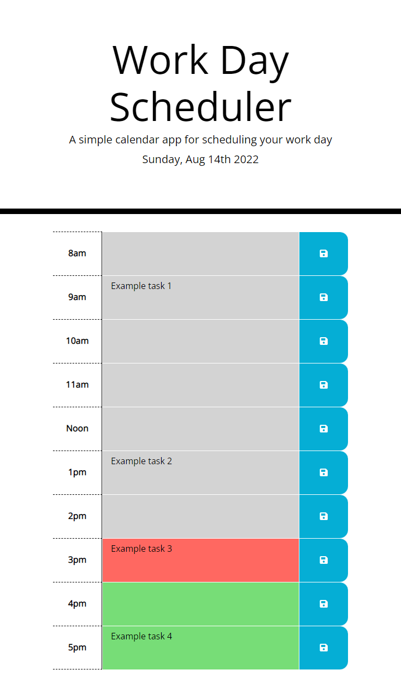

# Work Day Scheduler App

## About This Project

This is a daily scheduler app that allows you to click on the area for each hour of the work day, then enter tasks to do in that text area. The text areas change color depending on the current hour of the day. Once you click the blue save button on the right, the task is saved to localStorage for retrieval if the page is refreshed or closed and reloaded.

## Built With

* HTML
* CSS
* JavaScript

## Website URL

https://apatheticjedi.github.io/work-day-scheduler-app/

##

Created by David Lundt

